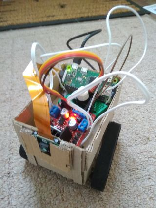

# raspberry-zumo



## Parts

* [Zumo chassis kit](https://www.amazon.co.uk/gp/product/B01M00W194) ([user guide](https://www.pololu.com/docs/pdf/0J54/zumo_chassis.pdf))
* 2 [298:1 Micro Metal Gearmotor (Extended back shaft)](https://shop.pimoroni.com/products/micro-metal-gearmotor-extended-back-shaft) (motors with smaller gear reduction will not have enough torque!)
* [Raspberry Pi\_16GB\_DS Pi 16 GB Official NOOBS Micro SD Card](https://www.amazon.co.uk/Raspberry-Pi_16GB_DS-Pi-Official-NOOBS/dp/B01D4TW25Y)
* [Raspberry Pi Zero W (Wireless) & Zero Essentials Kit](https://www.amazon.co.uk/gp/product/B06XCYGP27) with HDMI and USB adapter cable.
* [Poweradd Slim2 5000mAh Portable Charger Power Bank](https://www.amazon.co.uk/Poweradd-Portable-Technology-Lightning-Included-Black/dp/B00MWU1GGI)
* [L298N Dual H Bridge Stepper Motor Driver](https://www.amazon.co.uk/TIMESETL-Stepper-Controller-Electric-Projects/dp/B077YC3JX9)
* [Raspberry Pi Zero Camera Module](https://www.amazon.co.uk/Raspberry-Camera-Module-Webcam-Support/dp/B0748FZXW3) (with narrow camera cable to fit the Raspberry Pi Zero!)
* [Elegoo 6PCS 170 tie-points Mini Breadboard kit](https://www.amazon.co.uk/Elegoo-tie-points-Breadboard-Breadboards-Electronic/dp/B01N0YWIR7)
* [Elegoo breadboard jumper wires](https://www.amazon.co.uk/gp/product/B01EV70C78)
* USB charger
* 4 AA rechargeable batteries
* AA battery charger

Furthermore you need a USB keyboard and a monitor with an HDMI socket to setup the Raspberry Pi.
If you want to connect a mouse in addition to the keyboard, you will need a USB hub.

## Installation

1. Setup LAN Wifi connection on the Raspberry Pi Zero W.
1. Use *rpi-config* to enable SSH remote login on the Raspberry Pi Zero W.

On the Raspberry Pi Zero W:
```
sudo apt-get install ffmpeg
sudo rpi-update # to make sure the v4L2 drive is available.
sudo modprobe bcm2835-v4l2 # to load it and create /dev/video0
sudo cp etc/ffserver.conf /etc
```

## Run
### On the Raspberry Pi

Run the control software.
```
./server.rb
```

Run the FFmpeg server.
```
ffserver -d
```

Start the camera stream.
```
./etc/webcam.sh
```

### On the PC
Run the XBox client.
```
./client.rb
```

Run the camera display.
```
sudo modprobe bcm2835-v4l2
./etc/play.sh
```

## External Links

* [Raspberry Pi Zumo Robot](http://www.explainingcomputers.com/rasp_pi_robotics.html)
    * [#1: GPIO Control](https://www.youtube.com/watch?v=41IO4Qe5Jzw)
    * [#2: Zumo Robot](https://www.youtube.com/watch?v=AZSiqj0NZgU)
    * [#3: Keyboard Control](https://www.youtube.com/watch?v=XvOONPSoglY)
    * [#4: SSH Network Control](https://www.youtube.com/watch?v=44yNbFictEg)
    * [#5: Line Follower](https://www.youtube.com/watch?v=Z5_8Va8QxnY)
* [Arduino DC motor tutorial](https://howtomechatronics.com/tutorials/arduino/arduino-dc-motor-control-tutorial-l298n-pwm-h-bridge/)
* [Enable SSH on Raspberry Pi](https://www.raspberrypi.org/documentation/remote-access/ssh/)
* [SSH config file](https://nerderati.com/2011/03/17/simplify-your-life-with-an-ssh-config-file/)
* [Ruby conversion of RPi.GPIO Python module](https://github.com/ClockVapor/rpi_gpio)
* [Sockets in Ruby](https://github.com/practicingruby/guides/wiki/Socket)
* [Arduino button tutorial](https://www.arduino.cc/en/Tutorial/Button)
* [Raspberry Pi camera configuration](https://www.raspberrypi.org/documentation/configuration/camera.md)
* [sudo rpi-update and sudo modprobe bcm2835-v4l2](https://www.raspberrypi.org/forums/viewtopic.php?t=68247)
* [FFmpeg streaming on Raspberry Pi](https://www.hackster.io/whitebank/rasbperry-pi-ffmpeg-install-and-stream-to-web-389c34)
